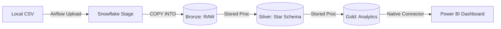

# ✈️ Airline Data Warehouse ETL


**End-to-End Data Engineering проект**, реализующий полный цикл обработки данных: от загрузки сырых CSV файлов до построения аналитической витрины и дашборда.

Проект демонстрирует построение **ELT-пайплайна** (Extract, Load, Transform) с использованием современной архитектуры "Медальон" (Bronze → Silver → Gold) и оркестрацией через Apache Airflow.

---

## 🏗 Архитектура

Данные проходят следующий путь:
1.  **Source:** Локальные CSV файлы с данными о полетах.
2.  **Orchestration:** Apache Airflow (в Docker) управляет загрузкой файлов и запуском процедур трансформации.
3.  **Data Warehouse (Snowflake):**
    * **Bronze Layer:** Загрузка сырых данных "как есть" (Raw Data) из Stage.
    * **Silver Layer:** Очистка, дедупликация, применение SCD (Type 1), построение схемы "Звезда" (Facts & Dimensions).
    * **Gold Layer:** Агрегированные витрины данных для бизнес-аналитики.
4.  **Visualization:** Power BI подключается напрямую к Gold слою.



---

## 🛠 Технологический стек

* **Infrastructure:** Docker & Docker Compose.
* **Orchestration:** Apache Airflow 2.9 (Official Image).
* **DWH:** Snowflake (Standard Edition).
* **Languages:** SQL (Snowflake Dialect), Python (Airflow DAGs).
* **BI:** Microsoft Power BI Desktop.
* **Version Control:** Git & GitHub.

---

## 🚀 Как запустить проект (Пошаговая инструкция)

### Шаг 1. Подготовка Snowflake

1.  Создайте аккаунт на [signup.snowflake.com](https://signup.snowflake.com/) (Trial версия подходит).
2.  Войдите в консоль Snowflake.
3.  Скопируйте ваш **Account URL** (он понадобится для Airflow и Power BI).
    * *Формат:* `abc12345.us-east-1` (Organization-Account) или классический URL локатора.

### Шаг 2. Запуск инфраструктуры (Docker)

Убедитесь, что у вас установлен **Docker Desktop**.

1.  Клонируйте репозиторий:
    ```bash
    git clone [https://github.com/YOUR_USERNAME/snowflake-airflow-etl.git](https://github.com/YOUR_USERNAME/snowflake-airflow-etl.git)
    cd snowflake-airflow-etl
    ```
2.  Запустите Airflow в фоновом режиме:
    ```bash
    docker-compose up -d
    ```
3.  Проверьте, что контейнеры запущены:
    ```bash
    docker ps
    ```
4.  Откройте UI Airflow в браузере: [http://localhost:8080](http://localhost:8080).
    * **Логин:** `airflow`
    * **Пароль:** `airflow`

### Шаг 3. Подключение Airflow к Snowflake

1.  В UI Airflow перейдите в меню **Admin** -> **Connections**.
2.  Создайте новое соединение или отредактируйте `snowflake_default`.
3.  Заполните параметры:
    * **Connection Id:** `snowflake_default`
    * **Conn Type:** `Snowflake`
    * **Host:** `<ваш_account_id>.snowflakecomputing.com`
    * **Schema:** `PUBLIC`
    * **Login:** Ваш логин Snowflake.
    * **Password:** Ваш пароль.
    * **Account:** `<ваш_account_id>` (первая часть URL до точки).
    * **Warehouse:** `COMPUTE_WH`
    * **Database:** `AIRLINE_DWH`
    * **Role:** `ACCOUNTADMIN` (или `SYSADMIN`, если настроены права).

### Шаг 4. Деплой объектов базы данных (DAG 1)

Запустите DAG **`01_init_snowflake_objects`**.
Этот пайплайн выполняет DDL скрипты из папки `sql/` и создает структуру DWH:
* Базу данных `AIRLINE_DWH`.
* Схемы `BRONZE`, `SILVER`, `GOLD`, `UTILS`.
* File Formats (CSV парсеры).
* Stored Procedures (Логика трансформации с правами `EXECUTE AS OWNER`).

### Шаг 5. Запуск ETL Пайплайна (DAG 2)

Запустите DAG **`02_airline_etl_pipeline`**.
Он выполнит полный цикл обработки данных:
1.  **Extract:** Загрузит локальный CSV файл в Snowflake Stage.
2.  **Load Bronze:** Выполнит команду `COPY INTO` в таблицу `RAW_AIRLINE_DATA`.
3.  **Transform Silver:** Разнесет данные по таблицам `DIM_PASSENGER`, `DIM_AIRPORT`, `FACT_FLIGHT` (очистка, нормализация).
4.  **Transform Gold:** Рассчитает витрину `FLIGHT_ANALYTICS` (агрегаты по рейсам и задержкам).

---

## 📊 Подключение Power BI

Чтобы визуализировать результаты:

1.  Откройте **Power BI Desktop**.
2.  Нажмите **Get Data** -> **Snowflake**.
3.  В поле **Server** введите ваш URL (без `https://`).
4.  **Warehouse:** `COMPUTE_WH`.
5.  **Data Connectivity mode:** Import.
6.  Введите учетные данные (User/Password).
7.  В навигаторе выберите: `AIRLINE_DWH` -> `GOLD` -> `FLIGHT_ANALYTICS`.
8.  Нажмите **Load** и постройте дашборд.

---

## 📂 Структура проекта

```text
├── dags/
│   ├── 01_init_snowflake_objects.py  # DAG инициализации (DDL)
│   └── 02_airline_etl_pipeline.py    # Основной ETL пайплайн
├── sql/
│   ├── 00_ddl/                       # Создание таблиц (Bronze, Silver, Gold)
│   ├── 01_procedures/                # Хранимые процедуры (ELT логика)
│   └── 02_dml/                       # Вспомогательные скрипты
├── data/                             # Исходные CSV файлы (примеры)
├── docker-compose.yaml               # Конфигурация Airflow и сервисов
└── README.md                         # Документация проекта
```

---

## 💡 Ключевые особенности реализации

* **Snowflake RBAC:** Использование модели `EXECUTE AS OWNER` в процедурах позволяет Airflow выполнять сложные трансформации, имея минимальные права, при этом процедуры выполняются от имени владельца схемы.
* **Handling Duplicates:** Реализована логика дедупликации в Silver слое (через `GROUP BY` перед `MERGE`), что решает проблему ошибок `Duplicate row detected` при грязных входных данных.
* **Data Parsing:** Настроен кастомный `FILE FORMAT` в Snowflake для корректной обработки CSV с кавычками и нестандартными разделителями.
* **Idempotency:** Все скрипты и DAGи написаны идемпотентно — повторный запуск не дублирует данные и не ломает пайплайн.

---

### Автор
Eduard Stsiablou / eduste
